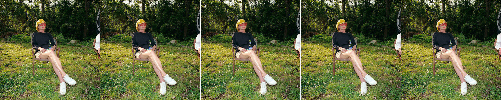
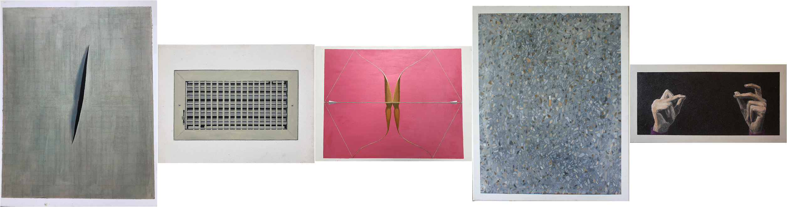

### The Pattern Language Reading Group

### Mr. and Miss. Vaughn

### Theory of Surface

   

##### Please send questions or comments to <contact@chainofbeing.org>.  Unless otherwise credited, chainofbeing.org holds copyright on all content herein (© 2022).  If you would like to monetize any value you find in this content, please donate to [Southern Environmental Law Center](https://www.southernenvironment.org/how-to-help/give-today/), [Nature Conservancy](https://support.nature.org), or [Athen's Land Trust](https://connect.clickandpledge.com/w/Form/0d8d085d-92e9-4d3e-9d93-0052b950471b?637236895579056391) on behalf of chainofbeing.org. 

