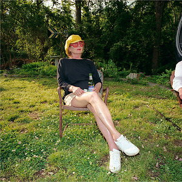

### Mr. and Miss. Vaughn

### [Listen to it](mmVaughn.mp3)

##### vocals: Sara Vaughn



photo by Carl Martin published in *[Carl Martin](http://lenscratch.com/2018/11/carl-martin-an-eponymous-book-of-photography/)*

Audio samples from assorted works by Duke Ellington, Brian Eno, Charlie Parker, and Charles Mingus

#### "Mr. and Miss. Vaughn" is a [continuous piece](mmVaughn.mp3), but individul tracks can be accessed below.  Click on title to play and arrow to see lyrics.

##### [Charlie Parker at the Beach](CharlieParkerattheBeach.mp3)
<details>
  <summary>"We don't play . . ."</summary>

```text

We don't play The Beach Boys
	at the beach.
We wake early,
Vacant time drawing us back
From its collapsing alternative.
Contest of vacuums,
Sound from a dead man's horn,
Sun-toasted, salt-cured, soured,
Shaken out from a cobweb of wires
	in the big skull of a saxophone player
The note itself sixty years old,
Bound to get older,
Rewiring me

What a complicated path . . .

One note follows another,
One foot in front of the other.
As I passed the studio window,
He waved to me
While recording
"Bird of Paradise"
	- Blowing it out,
		just like that.
Some minds are so vast
That they become ensnared
And then enslaved
By music.

Charlie Parker was a city
And a plump, black vagrant,
Disheveled,
But like we beach-goers
Straining against the day's brilliance,
He was just scouting short-cuts
To a deeper joy.

```

</details>

##### [Thunderbird](Thunderbird.mp3)
<details>
  <summary>"We parallel a . . ."</summary>

```text

We parallel a wall-cloud in the Thunderbird.
At this clip, we'll out-pace the word
That hovers on waters.

What flies through the wireless-tower wires?
Spires power tireless, Sea-Doo highs that heal me

And you can be healed.

Testify! Testify!

I've seen the golden funnel way up high
And I shiver from waiting on God,

Yet the sky is a thick velvet curtain
That is rending to reveal your face,
A face stupid with brightness.

As close as a scorned lover,
Dry blue desert breath:
This is no good ship’s design
In which to practice death.

But it was only a test.
We are still blanks of the lathe.
I concede then protest. 
We are drag in the great swathe
Of time.

```

</details>

##### [The Details Surrounding Your Birth](TheDetailsSurroundingYourBirth.mp3)
<details>
  <summary>"Under the sky . . ."</summary>

```text

Under the sky
I change my skin 
And the sky's clouds 
Are held back
In a circle
By a force 
From my head and eyes
That extends nearly to the horizon.

Child,
Bathe in your cozy restaurant:
Your ears hear the double time
Of your own heart in relation to your mother's.
You breathe into your ears
And taste yourself.

You are possessed.

Who else believes 
That when you look through a telescope
Into the clear Winter night
Before your birth
(As I hold the clouds away)
That the lights you see
Are dead souls imagining their reality?

Who else believes
That the embryo is charged 
With electric residue of the near-dead?

If you believe
	- Stand there
If you're curious
	- Stand over there 
If you've only come for the refreshments
	- Well, your power is not a force
		But it's endearing.

Under the skin of my eyelid is a film
As between the skin of the womb and you -
Blink into this magic hour
That outlines those up-ahead in gold light
And casts our shadows on those behind.

```

</details>

##### [Form](Form.mp3)
<details>
  <summary>"Your form . . ."</summary>

```text

Your form,
With his bow drawn,
Is waiting, incompletely,
To be stepped into.

In Autumn
Millions of leaves fall
To the ground.

Release one.

Facing you,
Reflected in atomic detail,
Is another archer
Unloading the full envelope of his energy
Through your arrow.

```

</details>

##### [Justice](Justice.mp3)
<details>
  <summary>"Ashes to ashes . . ."</summary>

```text

Ashes to ashes,
Just to just.

I just want a place
Where there’s just enough;

Just enough water to make some seed;
Just enough scratch to make it bleed;
Just enough salt to get us by;
Just enough hope to get us high.

I just want to clean-up after people 
on business trips
and then get brought bad news
	on little pink slips.

I just wanna be president
Within an abstract boundary
That separates brothers and sisters.

I just want it to be right
Even if it’s wrong;

Just to be a lawyer, who knows the rule,
Or a doctor, maybe,
Or a fool;

Just to be conscious of the Heraclitian struggle
Of every atom to exist
	- To make ends meet
And to be happy.

“You there, in the blue shirt,
What do you want to do
When you grow up?”
	- I’d like to be a writer.
“Just a writer?”
	- Just.


```

</details>

##### [The Clock](TheClock.mp3)
<details>
  <summary>"I can see it . . ."</summary>

```text

I can see it so much better
When it
the clock
Is hidden.

I can
the clock
Meet you at coordinates
Three-million years from now
No, now!
the clock

Crickets keep time
But
the clock
They can't keep reality
Any more than Autumn can

the clock

Cesium, love
Quartz, hunger
Springs, reflex
the clock
Water, gravity

The gut-reckoned ratio
Between living a thousand years
the clock
And living forever

How many days are in a week?
the clock
There will always be roads
There will always be Yale

the clock

I remove your blouse
Your skirt, brassiere, and panties
the clock 
And check you for ticks

Tocs.

```

</details>

##### [Chain of Being](ChainofBeing.mp3)
<details>
  <summary>"The thunder . . ."</summary>

```text

The thunder, my love,
Will shake the poetry
From this sentiment
And exhume its minor significance
Unto the living world.

Sun-kiss
Love-letter fire
The back-lit vista
That subsumes death and birth
	-An origin of species

The thunder, my love,
Will tear the paper
Of this snare,
But the lightening
Won't make a sound

"Sounds like a dream."
	-"It was a dream."
"What do you mean"
	-"I really had that dream."

The thunder, my love,
Allows me this refrain.

The clay road ends
Onward, onward
On foot
Through pines
Toward moonlight,
Passively accumulating
Memories and bugs
	-Rivers and cities
On to the next life.

```

</details>

<p> <br /> </p>
<p> <br /> </p>

##### Please send questions or comments to <contact@chainofbeing.org>.  Unless otherwise credited, chainofbeing.org holds copyright on all content herein.  If you would like to monetize any value you find in this content, please donate to [Nature Conservancy](https://support.nature.org), [Land Trust Alliance](https://donate.lta.org), or [Athen's Land Trust](https://connect.clickandpledge.com/w/Form/0d8d085d-92e9-4d3e-9d93-0052b950471b?637236895579056391) on behalf of chainofbeing.org.

##### [See other chainofbeing.org projects](../index)
