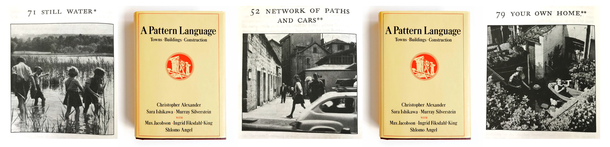

### The Pattern Language Reading Group

*“This seeming chaos which is in us is a rich, roiling, swelling, dying, lilting, singing, laughing, shouting, crying, sleeping order.  If we will only let this order guide our acts of building, the buildings that we make, the towns we help to make, will be the forests and the meadows of the human heart.”*  - Chris Alexander, *A Timeless Way of Building*

*A Pattern Language* attempted to formulate qualities of a built environment that support the fine balance between self, social connection, the natural world, and commerce.  The book was never presented as a static or final document but as solid starting point for the evolution of a humanist language about what makes places good to be in.  One of its charms is that you can apply it individually to your room or home.  Still, as with any language, it succeeds on the scale at which it is spoken and understood.  The Pattern Language Reading Group is our attempt to engage in a community-level dialogue spoken in such patterns.  The group is not a cult or indoctrination campaign; some of the original patterns are unfeasible at best and ridiculous at worst.  Yet, taken together, they represent a very explicit method to structure our surroundings to raise self-esteem, reduce bureaucratic fatigue, enhance generational bonds, and support good-health habits.  A utopian vision?  The patterns do not pretend that conflict, cruelty, illness, and greed do not exist; they only propose an environment that is flexible enough to absorb and redirect painful aspects of human life. 

The group is currently building a core membership and evaluating meeting locations.  Once established, we will hold monthly discussions focused on a single pattern, particularly as it relates to the local community.  A changing moderator will guide each month’s discussion.  Please contact us with questions or to express interest: <plrg@chainofbeing.org>.

#### Participating communities

Athens, GA, USA
When: Second Tuesday of each month
Where: TBA

#### Other resources

[Pattern Language](https://www.patternlanguage.com/) is a hub of ideas and literature associated with *A Pattern Language* and its authors.

[Building Living Neighborhoods](http://www.livingneighborhoods.org/ht-0/bln-exp.htm) contains techniques and examples of how patterns can interface with conventional building codes and city planning.

##### [See other chainofbeing.org projects](../index)
